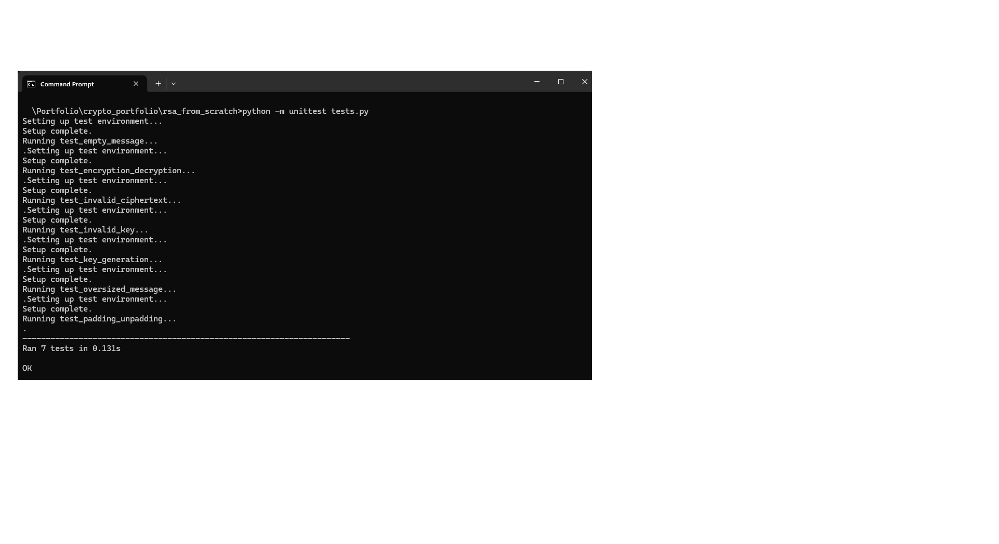
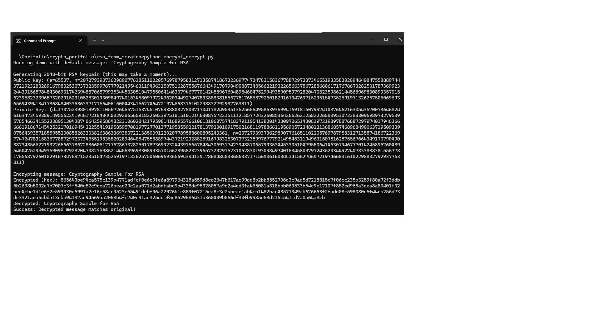

markdown
Copy
Edit
# RSA From Scratch

# RSA From Scratch


A Python implementation of RSA public-key cryptography, built from the ground up to demonstrate prime generation, key creation, and encryption/decryption with PKCS#1 v1.5 padding. This project is part of my [cryptography portfolio](https://github.com/Rob-Gravelle) and is intended for educational purposes.

## Features

- **Miller-Rabin Primality Test**: Generates large primes with high accuracy (false-positive probability < 4⁻⁴⁰).
- **Key Generation**: Produces RSA keypairs with a configurable bit length (default: 2048 bits).
- **Block-Based Encryption/Decryption**: Encrypts messages as a single block with PKCS#1 v1.5 padding for improved security.
- **User Input and File Support**: Supports console input, file input/output, and a default demo.
- **Test Suite**: Comprehensive unit tests running in ~0.12 seconds to verify correctness.

## Installation

1. Clone the repository:
   ```bash
   git clone https://github.com/Rob-Gravelle/cryptography_portfolio.git

Navigate to the RSA project directory:
bash

cd cryptography_portfolio/rsa_from_scratch

Ensure Python 3.6+ is installed. No external dependencies are required (uses only the Python standard library).

## Usage
Run the demo with the default message ("Cryptography Sample for RSA"):
bash

python encrypt_decrypt.py

Run in user input mode (up to 245 characters due to padding):
bash

python encrypt_decrypt.py -u -b 2048

Run with file input/output (e.g., from input.txt to output.txt):
bash

python encrypt_decrypt.py --input-file input.txt --output-file output.txt

Example output (demo mode):

Running demo with default message: 'Cryptography Sample for RSA'
Generating 2048-bit RSA keypair (this may take a moment)...
Public Key: (e=65537, n=<large modulus>)
Private Key: (d=<private exponent>, n=<large modulus>)
Encrypting message: Cryptography Sample for RSA
Encrypted (hex): 516919c4387c47998b63de756bc9bda7723399f6c609db33a89bd3105608c39a...
Decrypted: Cryptography Sample for RSA
Success: Decrypted message matches original!

Example output (user input mode):

Running in user input mode...
Note: Enter a message up to 245 characters (due to PKCS#1 padding). Press Ctrl+C to cancel.
Enter a message to encrypt: This is a new test for th RSA Portfolio
Generating 2048-bit RSA keypair (this may take a moment)...
Public Key: (e=65537, n=<large modulus>)
Private Key: (d=<private exponent>, n=<large modulus>)
Encrypting message: This is a new test for th RSA Portfolio
Encrypted (hex): a75dbdea6e34086cdb8dde8002d85eec3bf3fb529d5060a518dff670054add46...
Decrypted: This is a new test for th RSA Portfolio
Success: Decrypted message matches original!

Example output (file input mode):

Reading message from file: input.txt
Generating 2048-bit RSA keypair (this may take a moment)...
Public Key: (e=65537, n=<large modulus>)
Private Key: (d=<private exponent>, n=<large modulus>)
Encrypting message: In Congress, July 4, 1776...
Encrypted (hex): 5444ce9e018362d71162474bcdd95868d6bdb5fad1350a1c9e156110525c4616...
Writing ciphertext to: output.txt
Decrypted: In Congress, July 4, 1776...
Success: Decrypted message matches original!

Run the test suite:
bash

python -m unittest tests.py

The test suite runs in ~0.12 seconds, verifying key generation, encryption, decryption, padding, and file output.

## Files
keygen.py: Generates prime numbers using Miller-Rabin and creates RSA keypairs.

rsa.py: Implements block-based encryption/decryption with PKCS#1 v1.5 padding.

encrypt_decrypt.py: Demonstrates RSA with user input, file input/output, or a default demo.

tests.py: Unit tests for key generation, encryption, decryption, and padding.

## Design Choices
Miller-Rabin Primality Test: Uses 40 iterations for a false-positive probability < 4⁻⁴⁰, suitable for 2048-bit keys.

Public Exponent: Uses e = 65537 for efficiency and compatibility.

Key Size: Defaults to 2048 bits, supporting messages up to ~245 bytes with padding.

PKCS#1 v1.5 Padding: Adds randomization to mitigate attacks, though not as secure as OAEP.

Hex Ciphertext: Outputs ciphertext as a hexadecimal string for readability.

## Security Considerations
This is an educational / Portfolio implementation and should not be used in production. Limitations include:
Limited Side-Channel Protections: Vulnerable to timing attacks due to standard modular exponentiation.

PKCS#1 v1.5 Padding: Less secure than OAEP; included for educational purposes.

No Key Management: Keys are generated for each run, not stored securely.

For production, use libraries like PyCryptodome or OpenSSL with OAEP padding and larger keys.

## Running Tests
Verify correctness with the test suite:
bash

python -m unittest tests.py

## Screenshots
Test Suite Output


Demo Mode Output
 

